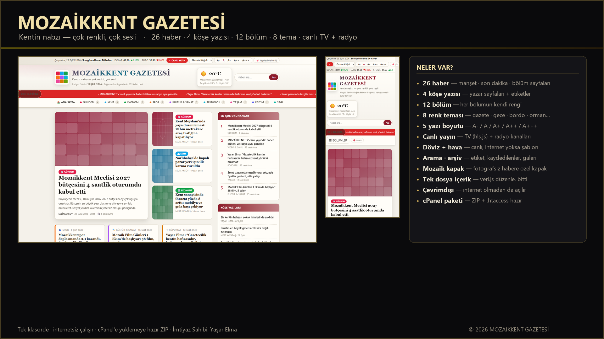
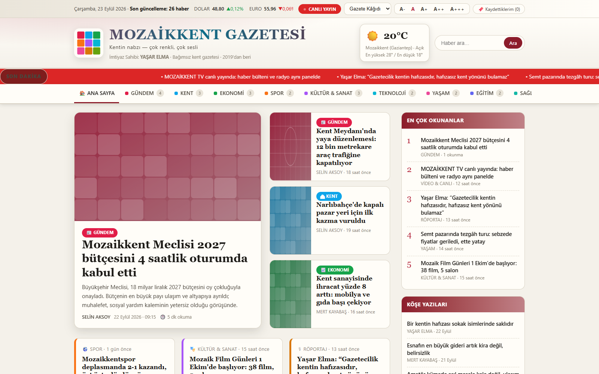
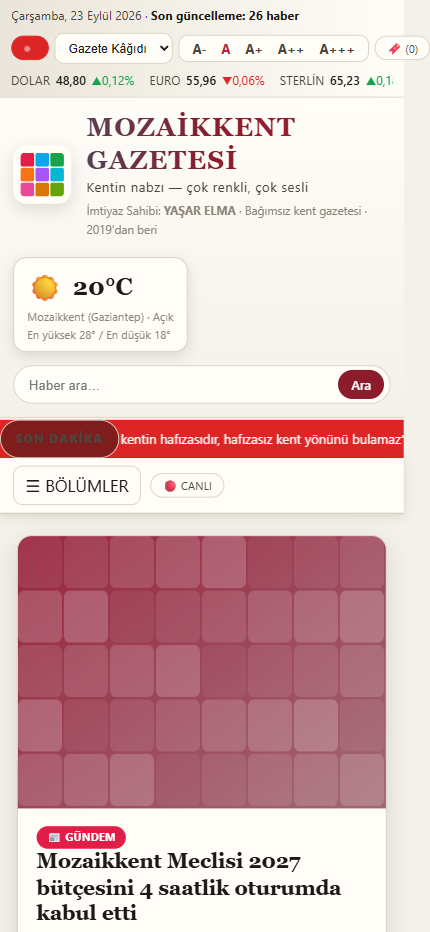
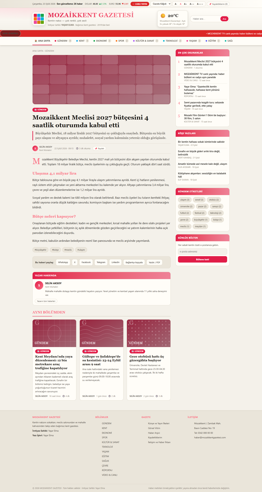
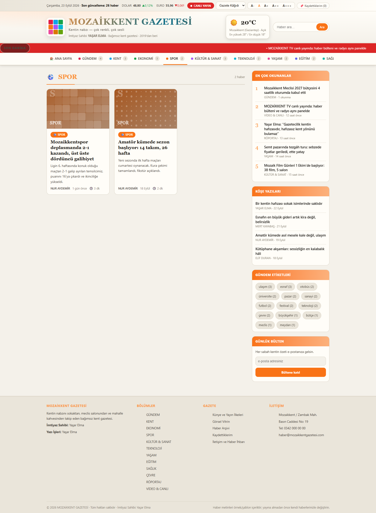
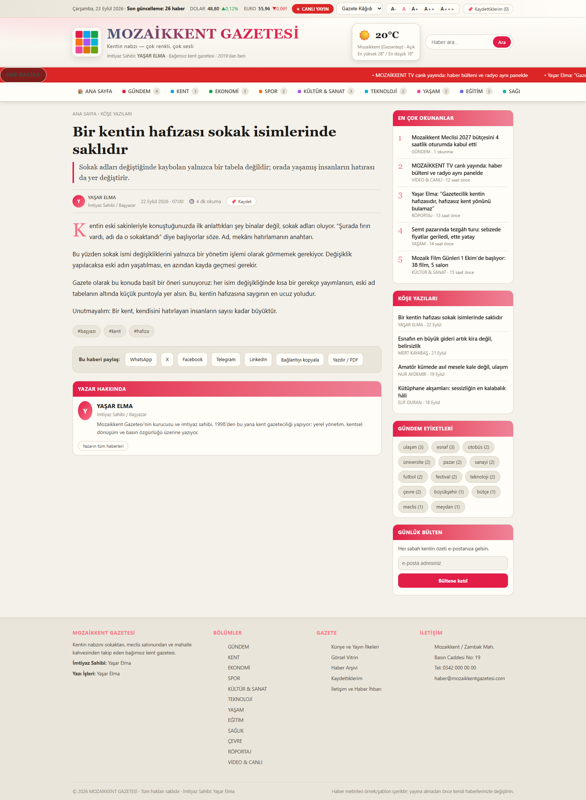
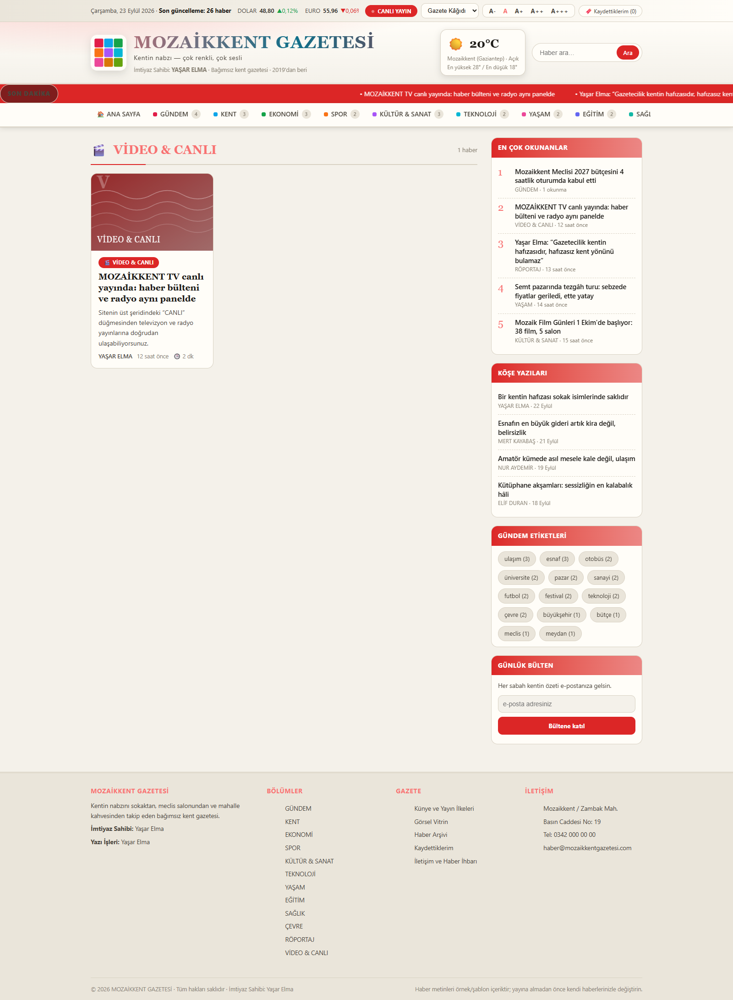
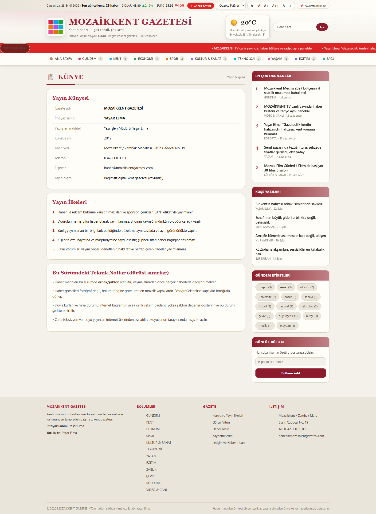
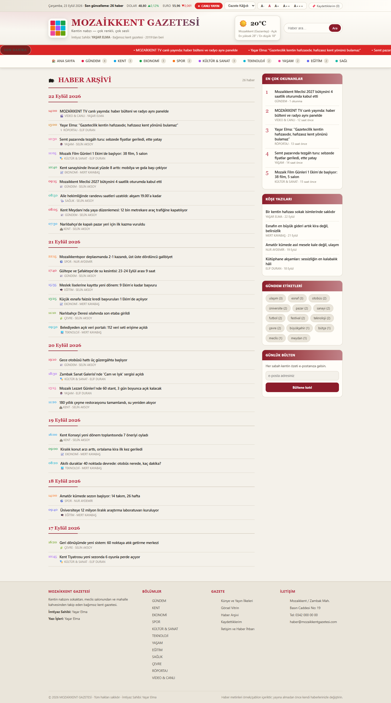
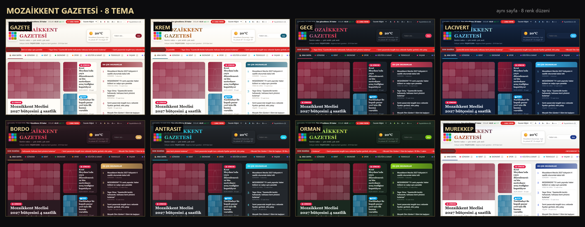

# 🗞 MOZAİKKENT GAZETESİ

**Kentin nabzı — çok renkli, çok sesli**
Bağımsız kent gazetesi · 2019'dan beri · İmtiyaz Sahibi: **YAŞAR ELMA**

Tek klasörde çalışan, internetsiz de açılan, cPanel'e yüklemeye hazır **kent gazetesi sitesi**.
26 haber, 4 köşe yazısı, 12 bölüm, 8 renk teması, canlı TV + radyo, döviz ve hava durumu şeridi.

🌐 **Canlı site:** <https://www.mozaikkent.com/>



---

## 📌 Bu depo nedir?

MOZAİKKENT GAZETESİ'nin **tam kaynak yedeği**. Siteyi oluşturan bütün dosyalar (HTML, CSS, JavaScript,
içerik dosyası), örnek içerikleriyle birlikte burada durur; ayrıca yayına hazır ekran görüntüleri ve
cPanel yükleme paketi de depoda saklanır.

| Bilgi | Değer |
|---|---|
| Sürüm | 1.0 · 23 Eylül 2026 |
| Tür | Statik kent gazetesi sitesi (sunucu tarafı kod yok) |
| Dosya sayısı | 7 kaynak dosya + görseller |
| Toplam boyut | ~520 KB (yayına giren kısım) |
| Teknoloji | Saf HTML + CSS + JavaScript (bağımlılık: yalnız `hls.min.js`) |
| Çalışma | Çift tıklayınca açılır · internetsiz çalışır · veriler cihazda (localStorage) |
| İmtiyaz Sahibi | Yaşar Elma |

---

## 🖼 Ekran görüntüleri

<table>
<tr>
<td width="50%"><b>Ana sayfa</b><br>Manşet, son dakika şeridi, bölüm blokları, köşe yazıları<br></td>
<td width="50%"><b>Mobil görünüm</b><br>Telefonda tek sütun, tam uyumlu<br></td>
</tr>
<tr>
<td width="50%"><b>Haber sayfası</b><br>Başlık, spot, yazar, okuma süresi, etiketler, ara başlıklar<br></td>
<td width="50%"><b>Bölüm sayfası</b><br>Her bölümün kendi rengi ve simgesi<br></td>
</tr>
<tr>
<td width="50%"><b>Köşe yazısı</b><br>Yazar bilgisi ve okuma düzeni<br></td>
<td width="50%"><b>Canlı yayın</b><br>TV kanalları (hls.js) + radyo kanalları<br></td>
</tr>
<tr>
<td width="50%"><b>Künye</b><br>İmtiyaz sahibi, iletişim, adres<br></td>
<td width="50%"><b>Arşiv</b><br>Tarih sırasına göre tüm haberler<br></td>
</tr>
</table>

**8 renk teması — aynı sayfa, sekiz düzen:**


Tam boy (kesilmemiş) sayfa görüntüleri: [`ekranlar/01-ana-sayfa.png`](ekranlar/01-ana-sayfa.png) ·
[`ekranlar/07-mobil-ana-sayfa.png`](ekranlar/07-mobil-ana-sayfa.png)

---

## ✨ Özellikler

**İçerik ve sayfalar**

- 📰 **Manşet düzeni** — 1 büyük manşet + 2 yan manşet + son dakika şeridi
- 🏙 **12 bölüm** — Gündem, Kent, Ekonomi, Spor, Kültür & Sanat, Teknoloji, Yaşam, Eğitim, Sağlık, Çevre, Röportaj, Video & Canlı
- 📝 **4 köşe yazısı** — yazar sayfaları ve yazar bazlı listeleme
- 🏷 **30 etiket** — etiket sayfaları üzerinden konu gezinmesi
- 🔎 **Arama** — başlık, spot ve gövde içinde arama
- 🗂 **Arşiv** — tarih sırasına göre tüm içerik
- 🖼 **Galeri** — görsel vitrin
- 🔖 **Kaydedilenler** — okuyucunun kendi listesi (cihazda saklanır)
- 📄 **Künye ve İletişim** — imtiyaz sahibi, telefon, adres, e-posta

**Görsel ve okuma**

- 🎨 **8 renk teması** — Gazete · Krem · Gece · Lacivert · Bordo · Antrasit · Orman · Mürekkep
- 🔠 **5 yazı boyutu** — A‑ / A / A+ / A++ / A+++
- 🧩 **Mozaik kapak** — fotoğrafı olmayan haberlere bölüm rengiyle çizilen 4 desenli (mozaik · izgara · dalga · nokta) özgün kapak
- 📱 **Tam mobil uyum** — 430 pikselden masaüstüne kadar tek düzen akışı
- 🎯 **Renkten yer bulma** — her bölümün kendi rengi başlıkta, kartta ve sayfada görünür

**Canlı yayın ve veri**

- 📺 **Canlı TV** — 5 kanal, `hls.min.js` ile (TRT yayınları)
- 📻 **Canlı radyo** — 6 kanal
- 💱 **Döviz şeridi** — internet varsa canlı (ECB/Frankfurter), yoksa "ŞABLON" etiketiyle örnek değer
- 🌤 **Hava durumu** — internet varsa canlı (Open‑Meteo), yoksa şablon

**Teknik**

- ⚡ **Sunucu gerekmez** — statik; veritabanı, PHP, üyelik yok
- 🔌 **Çevrimdışı çalışır** — dosyayı çift tıkla, açılır
- 🔐 **Veri cihazda** — tema, yazı boyutu ve kaydedilenler localStorage'da kalır
- 🧭 **Hash yönlendirme** — `#/haber/...`, `#/bolum/...`, `#/yazar/...` doğrudan bağlantı verilebilir

---

## 📁 Klasör yapısı

```
MOZAIKKENT-GAZETESI/
├── index.html               site iskeleti: başlık, şerit, menü, alt bilgi            (154 satır · 6,8 KB)
├── assets/
│   ├── css/stil.css         renkler, 8 tema, düzen, mozaik kapak desenleri          (361 satır · 21,8 KB)
│   ├── js/veri.js           İÇERİK: GAZETE, BOLUMLER, YAYINLAR, HABERLER, KÖŞE      (602 satır · 35,9 KB)
│   ├── js/uygulama.js       motor: sayfa çizimi, arama, tema, yayın oynatıcı        (892 satır · 47,8 KB)
│   ├── js/hls.min.js        canlı TV yayınlarını oynatan hazır kütüphane           (415 KB)
│   └── img/                 haber fotoğrafları buraya konur (yoksa mozaik kapak)
├── ekranlar/                bu depoya özel: kapak, sayfa görüntüleri, 8 tema vitrini
├── yukleme/                 cPanel yükleme paketi: ZIP + .htaccess + OKU-BENI.txt
└── OKU-BENI.md              ayrıntılı kullanım kılavuzu (Türkçe)
```

---

## 🚀 Açma ve yayına alma

**Bilgisayarda açmak:** `index.html` dosyasına çift tıkla. (Döviz, hava ve canlı yayın için internet gerekir.)

**Telefonda açmak:** klasörü telefona kopyala, `index.html`'e dokun.

**cPanel'de yayına almak (özet):**

1. cPanel → Dosya Yöneticisi → hedef klasöre gir.
2. `yukleme/MOZAIKKENT-GAZETESI.zip` dosyasını yükle ve **Extract** et (ZIP'in kökünde doğrudan `index.html` var).
3. `.htaccess` dosyasını da hedef klasöre kopyala (HTTPS yönlendirmesi + önbellek kuralları).
4. Telefondan açıp menüyü, bir haberi ve **CANLI YAYIN** düğmesini dene.

Ayrıntılı adımlar: [`OKU-BENI.md`](OKU-BENI.md)

---

## ✍️ Haber eklemek (tek dosya)

Tüm içerik **`assets/js/veri.js`** içindedir. `HABERLER` listesine yeni kayıt eklenir:

```js
{
  id: "zambak-yol",                       // benzersiz kısa ad (Türkçe harf ve boşluk yok)
  bolum: "yerel",                         // BOLUMLER listesindeki id
  baslik: "Zambak Mahallesi'nde yol yenileme başladı",
  spot: "Kısa özet cümlesi.",
  yazar: "selin-aksoy",
  tarih: "2026-09-23 10:30",              // YYYY-AA-GG SS:DD
  sure: 3,                                // okuma süresi (dakika)
  etiket: ["yol", "Zambak", "belediye"],
  desen: "mozaik",                        // mozaik | izgara | dalga | nokta
  manset: 8,                              // (isteğe bağlı) ana sayfa manşet sırası
  foto: "assets/img/zambak-yol.jpg",      // (isteğe bağlı) fotoğraf
  govde: ["Birinci paragraf.", { alt: "Ara başlık" }, "İkinci paragraf."]
}
```

Bölüm eklemek için `BOLUMLER` listesine `{ id: "tarim", ad: "TARIM", renk: "#84cc16", simge: "🌾" }`
eklenir; menü, alt bilgi, rozet sayıları ve bölüm sayfası kendiliğinden oluşur.

---

## 📊 İçerik dökümü (sürüm 1.0)

| Alan | Adet |
|---|---|
| Haber | 26 |
| Köşe yazısı | 4 |
| Bölüm | 12 |
| Yazar | 5 |
| Etiket | 30 |
| Mozaik deseni | 4 (mozaik · izgara · dalga · nokta) |
| Renk teması | 8 |
| Yazı boyutu | 5 |
| Canlı yayın | 11 (5 TV + 6 radyo) |

---

## ⚠️ Dürüst notlar

- Sitedeki haber ve köşe yazısı metinleri **örnek/şablon** içeriktir; gerçek haberlerle değiştirilmelidir.
- Haber fotoğrafları henüz yok; yerlerine bölüm rengiyle çizilen mozaik kapaklar gösterilir.
- Okuyucu yorumu, üyelik ve yönetim paneli yok (sunucu tarafı kod gerektirir).
- İletişim formu sunucuya göndermez; kaydedince cihazın e-posta uygulamasını açar.
- Döviz ve hava durumu internet yoksa şablon değer gösterir ve şeritte "ŞABLON" yazar.
- Canlı yayın adresleri yayıncı kuruluşa aittir; adres değişirse `veri.js` içindeki `YAYINLAR` listesinden güncellenmelidir.

---

## 👤 Künye

**MOZAİKKENT GAZETESİ** · İmtiyaz Sahibi: **Yaşar Elma**
Mozaikkent / Zambak Mahallesi, Basın Caddesi No: 19
📞 0342 000 00 00 · ✉️ haber@mozaikkentgazetesi.com
© 2026 MOZAİKKENT GAZETESİ — Tüm hakları saklıdır.

*Bu depo, gazetenin tam kaynak yedeğidir (site dosyaları + ekran görüntüleri + yükleme paketi).*
